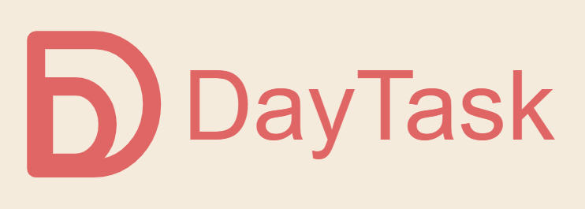

# DayTask

  
  <h1 align="center">DayTask</h1>

### 📚 Languages
- [中文](README_zh.md)

### 🚀 Introduction

- put images
- put a video

### ✨ Features
-  Create daily task list
-  Mark tasks as completed
-  Add and write personal memos
-  Customize the appearance

### 🌐 Environment

| Component | Version | Description        |
| --------- | ------- | ------------------ |
| Node.js   | 20.x    | JavaScript runtime |

### 📂 Project Structure

### ⚡ Quick Start

### 🎯 Core Tech

### 🤝 Contributing

We welcome contributions! Whether it's:

- Bug fixes
- New features
- Documentation improvements
- Translations

Please:  
- Check existing issues first  
- Open an issue to discuss major changes  
- Submit PRs with clear descriptions  

### 🔥 For Beginners

**This is an independent educational project, designed for learning and practice.**

If you are new to open source:
- Don’t worry! This project is meant to be beginner-friendly 
- You can start small (update README, add comments, fix small bugs) 
- You can build on top of this project, customize it, and even use it as part of your course assignments or personal practice projects.🤪

### 🎉 License
This project is licensed under the MIT License - see the [LICENSE](LICENSE) file for details.